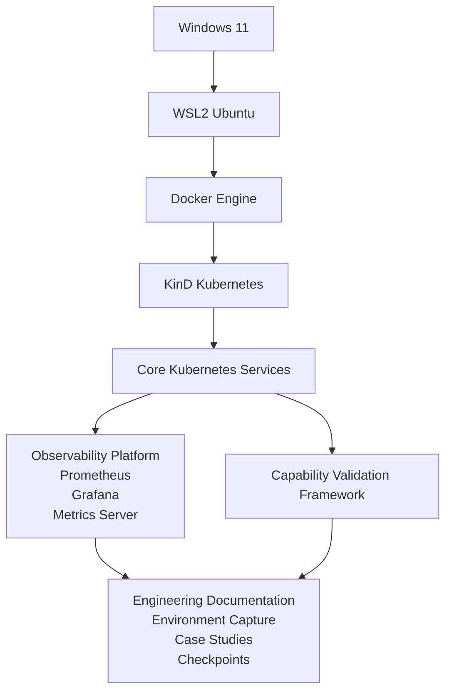

**Author:** Kevin Rutenberg  
**Version:** 0.9.0  
**Last Updated:** 31 docs/03-architecture.md July 2026

**Project:** Kubernetes Observability Lab

---

## Overview

## Design Goals

## Laboratory Architecture

## Host Platform

## WSL2 Environment

## Container Runtime

## Kubernetes Cluster

## Platform Services

## Networking

## Storage

## Operational Workflow

## Design Decisions

## Future Architecture

## Related Documentation

## Overview

The Kubernetes Observability Lab is built as a layered platform in which each component provides a well-defined capability while remaining independently understandable and replaceable.

The architecture intentionally separates the host operating system, container runtime, Kubernetes platform and observability tooling. This separation encourages reproducibility, simplifies troubleshooting and supports incremental experimentation without fundamentally changing the overall laboratory design.

Rather than attempting to reproduce a production environment, the laboratory provides a practical engineering platform for exploring Kubernetes behaviour, validating platform capabilities and integrating observability into repeatable operational workflows.

## Design Goals

The laboratory architecture has been designed to satisfy the following objectives:

- Remain fully reproducible on a single workstation.
- Separate platform layers with clear operational responsibilities.
- Minimise external dependencies.
- Support incremental capability expansion.
- Enable repeatable experimentation.
- Provide a stable foundation for observability integration.

## Laboratory Architecture

The laboratory is organised as a layered architecture in which each layer provides services to the layer above while remaining independently understandable and manageable.

This separation allows individual components to be upgraded, replaced or extended with minimal impact on the overall platform. It also simplifies troubleshooting by providing clear operational boundaries between the host operating system, container runtime, Kubernetes platform and engineering services.

At a high level, the laboratory consists of four architectural layers:

| Layer | Purpose |
|-------|---------|
| Host Platform | Provides the underlying operating system and virtualisation environment. |
| Kubernetes Platform | Delivers the core container orchestration capabilities. |
| Platform Services | Supplies operational tooling such as dashboards, observability and automation. |
| Engineering Layer | Provides capability validation, environment capture, documentation and experimentation workflows. |

The following sections describe each layer in more detail.

The laboratory architecture is governed by several guiding principles:

- Separate platform infrastructure from engineering tooling.
- Validate capabilities through observable behaviour.
- Prefer reproducibility over complexity.
- Introduce change incrementally and measure its effects.
- Preserve a known-good baseline before significant architectural changes.

## Host Platform

The laboratory is hosted on Microsoft Windows 11 and uses Windows Subsystem for Linux 2 (WSL2) to provide a native Linux environment for Kubernetes and supporting tooling.

This approach combines the familiarity and productivity of a Windows desktop with the flexibility of a Linux-based Kubernetes environment, while avoiding the resource overhead associated with traditional virtual machines.

The host platform is responsible for hardware access, virtualisation support and providing the foundation upon which the remainder of the laboratory is built.

## WSL2 Environment

Ubuntu 24.04 LTS provides the primary engineering environment for the laboratory.

All Kubernetes administration, automation, documentation and operational tooling execute within WSL2, ensuring a consistent Linux environment while remaining tightly integrated with the Windows host.

WSL2 also simplifies access to Linux-native tooling, package management and shell scripting without requiring a dedicated Linux workstation.

## Container Runtime

Docker Engine provides the container runtime used by KinD to create and manage the Kubernetes cluster.

Each Kubernetes node executes as a Docker container, allowing the complete cluster to be managed using standard Docker tooling while remaining isolated from the host operating system.

This architecture enables rapid cluster startup, straightforward maintenance and efficient use of system resources.

## Kubernetes Cluster

The laboratory uses KinD (Kubernetes in Docker) to provide a multi-node Kubernetes environment suitable for engineering, experimentation and operational validation.

The cluster forms the core of the laboratory and provides the platform upon which all subsequent services, validation frameworks and observability components are deployed.

Although designed for local development rather than production use, the cluster provides a realistic environment for understanding Kubernetes behaviour and platform operations.

## Platform Services

Several supporting services are deployed within the laboratory to extend the core Kubernetes platform with operational, management and observability capabilities.

These services provide functionality beyond Kubernetes itself and collectively form the engineering platform used throughout the laboratory.

Current platform services include:

- Kubernetes Dashboard
- Metrics Server
- Prometheus
- Grafana
- Portainer
- Jenkins
- GitHub Webhook integration
- kube-state-metrics

## Networking

Networking within the laboratory is provided by Kubernetes' native networking model together with the Container Network Interface (CNI) implementation supplied by KinD.

The networking layer enables communication between cluster components, service discovery, DNS resolution and workload connectivity, all of which are validated through the capability validation framework.

## Storage

Persistent storage is provided through Kubernetes StorageClasses and dynamically provisioned Persistent Volumes.

The laboratory validates storage capability by exercising the complete provisioning lifecycle rather than simply verifying the existence of storage resources, ensuring that persistent workloads can be deployed successfully.

## Operational Workflow

A typical engineering session follows a structured operational workflow designed to establish platform confidence before experimentation begins.

Start laboratory
↓
Validate platform capabilities
↓
Collect baseline observations
↓
Implement controlled change
↓
Observe and analyse results
↓
Document conclusions
↓
Commit validated improvements

## Design Decisions

The architecture has been designed to prioritise simplicity, reproducibility and engineering value over production-scale complexity.

Each architectural decision has been guided by the objective of creating a laboratory that supports learning, experimentation and operational understanding while remaining practical to maintain on modest hardware.

## Future Architecture

The laboratory architecture has been designed to evolve incrementally as additional platform capabilities and engineering workflows are introduced.

Future development is expected to include , expanded platform instrumentation and observability integration, additional operational tooling and a growing library of structured engineering experiments.

Throughout this evolution, the laboratory will continue to prioritise reproducibility, evidence-based engineering and clear separation of architectural responsibilities.

## Related Documentation

- `00-project-objectives.md`  
  Defines the overall objectives, scope and engineering philosophy of the project.

- `01-lab-overview.md`  
  Introduces the laboratory and provides a structured guide to the repository.

- `02-installation.md`  
  Documents installation, configuration and initial platform verification.

- `04-baseline.md`  
  Records baseline measurements used for future comparison and experimentation.

- `05-lab-environment.md`  
  Captures the current laboratory environment and software versions.

- `06-health-check-design.md`  
  Describes the design philosophy and architecture of the capability validation framework.

- `07-health-check-framework.md`  
  Explains the operation and extensibility of the health check framework.

- `CHANGELOG.md`  
  Summarises significant project milestones, architectural changes and feature evolution.
